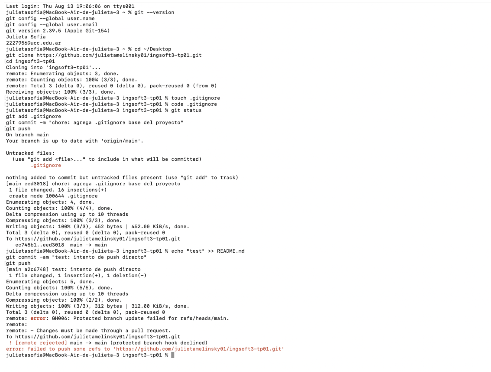
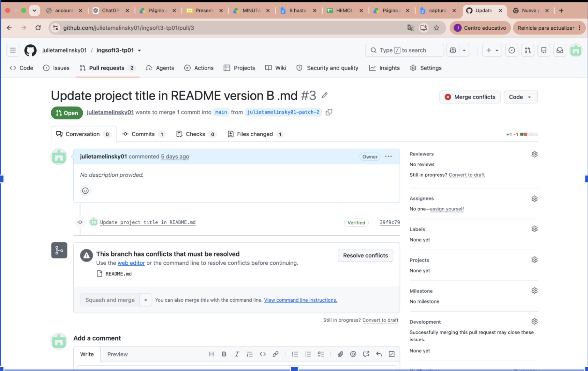
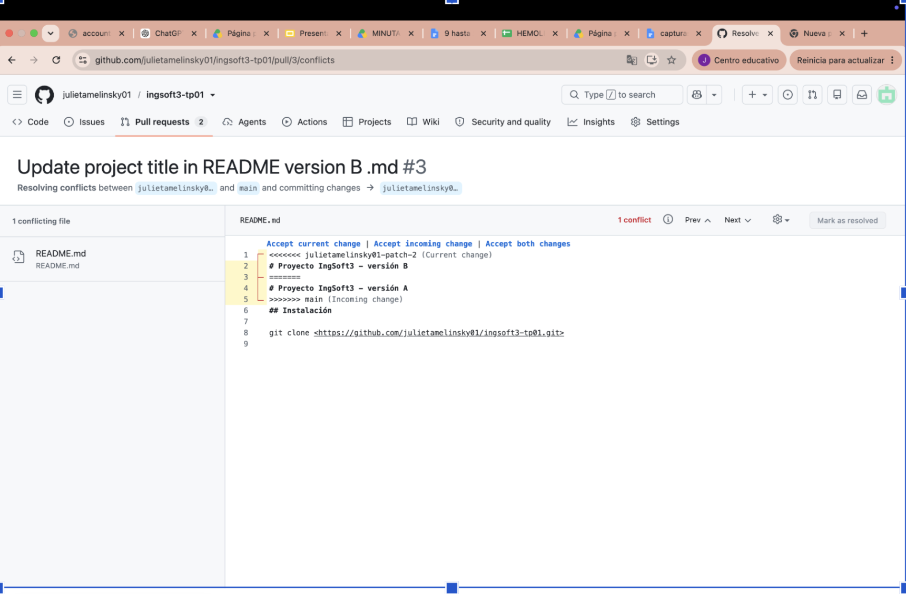
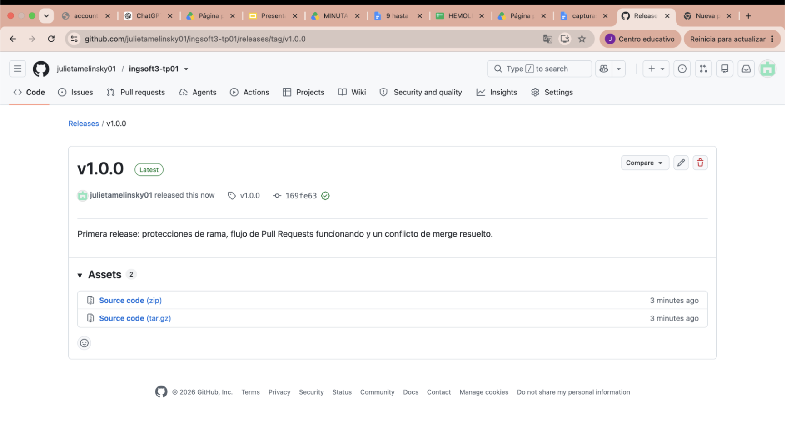

# Evidencias — TP1

## 1. Push directo a main rechazado

GitHub rechaza el push porque main está protegida y la regla alcanza también al dueño del repo.

## 2. El PR de la rama B no se puede mergear: conflicto

Al intentar mergear la rama B, GitHub avisa que hay conflictos con la base porque ambas ramas modificaron la misma línea del README.

## 3. Marcadores del conflicto

Los marcadores `<<<<<<<`, `=======` y `>>>>>>>` delimitan las dos versiones en conflicto (versión A y versión B) sobre la misma línea del README.

## 4. Release v1.0.0 publicada

La release v1.0.0 quedó publicada, apuntando al tag creado sobre el commit que incluye el conflicto resuelto.
